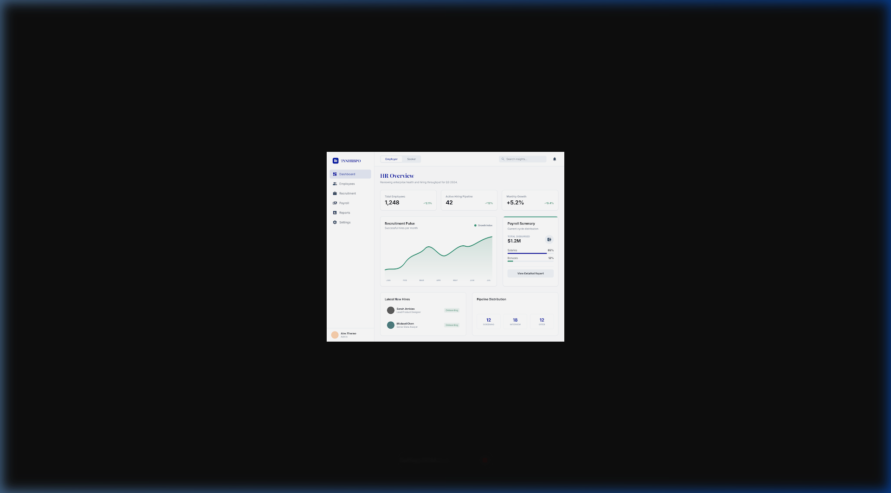
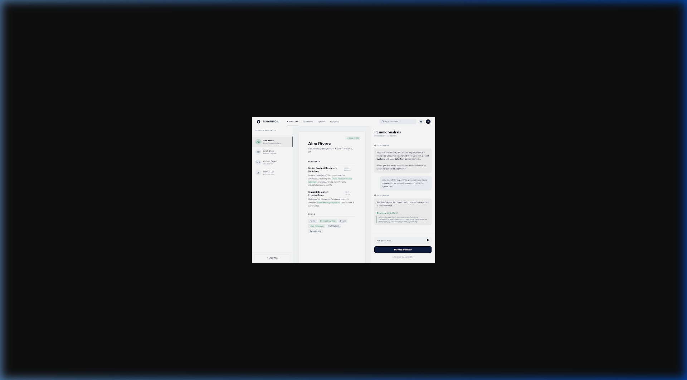
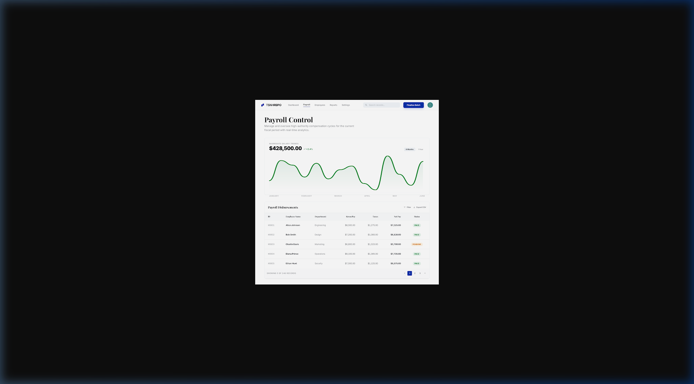

# TSNHRBPO: ERP Design System (v3.0 - Accentuated Minimalism)

## 1. Principle: "The Architecture of Clarity"
An ERP of this scale handles immense data density (11 service pillars). The design system must prevent "UI Fatigue" by utilizing **Extreme White Space** and **Precise Color Signaling**.

### 1.1 Aesthetic Foundation
- **The Canvas**: Pure White (`#FFFFFF`). No shadows except for layered active components.
- **The Authority**: Midnight Navy (`#0A1F44`). Used for Serif Typography to signal institution and reliability.
- **The Performance**: Muted Emerald (`#2D6A4F`). Used as a reward signal for performance, success, and growth.

---

## 2. ERP Component Logic
### 2.1 Technical Typography
- **Institutional Headers**: `Playfair Display (Bold)`
  - Use for: Section Titles, High-level Stats, Organization Name.
- **Operational Interface**: `Inter (Medium/Medium)`
  - Use for: Data tables, Inputs, Sidebar labels, Technical reports.

### 2.2 Data Visualization
- **Growth Charts**: Muted Emerald lines on a pure white background.
- **Compliance Grids**: Thin Pure Black hairlines (`1px`) to separate dense technical data.

---

## 3. Visual Assets (ERP Modules)
### 3.1 The Global HR Dashboard
Handles high-level stats across the 11 pillars.

### 3.2 AI Candidate Hub (P1: Recruitment)
Specialized split-view for deep resume analysis and chat insights.

### 3.3 Payroll & Compliance Control (P3: Payroll)
Focused on financial precision and disbursement health.

---

## 4. Accessibility & Scale
- **Responsive ERP**: Every complex table and form is designed for a mobile-first BPO workforce.
- **High-Density Modes**: Toggle between "Authoritative" (high padding) and "Technical" (compact) for data-heavy operations.
